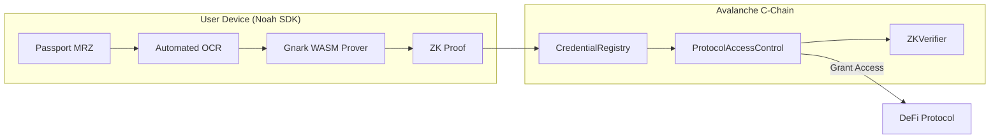

# NOAH: Privacy-Preserving KYC for Avalanche

**NOAH** (Network for On-chain Authenticated Handshakes) is a state-of-the-art, zero-knowledge proof-based identity protocol for the Avalanche ecosystem. It enables applications (Gaming, DeFi, and Consumer Apps) to verify user compliance (age, jurisdiction, sanctions) without ever touching or storing personal data.

## 🚀 The Noah Vision: "Verify Once, Use Everywhere"

Noah eliminates the redundancy of KYC on-chain. By using Zero-Knowledge Proofs (ZKP), users bind their identity to their wallet address once. This verification is then instantly reusable across every integrated app on Avalanche—from DeFi protocols to Web3 games—while maintaining 100% user privacy.

---

## 🌟 Use Cases

Here is what you can build with Noah:

### 1. Gaming & Web3 E-Sports
Keep your leaderboards fair. Verify that each player is a unique human behind the keyboard, putting an end to multi-accounting and bots.

### 2. Consumer Applications
Age-gate your content or services effortlessly. Prove your user is over 18 without asking them to upload a photo of their ID card to your servers.

### 3. DeFi & RWA Platforms
Onboard users securely. Meet strict KYC requirements while preserving your users' on-chain privacy.

---

## 🎨 Interactive Experience

Noah isn't just a protocol; it's a complete platform with professional presentation tools:

- **Professional Pitch Deck**: An interactive, slide-based presentation built directly into the UI to communicate Noah's value proposition to stakeholders.
- **Visual Data Flow**: A high-fidelity animated diagram that visualizes the technical process of transforming sensitive MRZ data into private ZK-Proofs.

---

## 🏗️ Architecture: Backend-less & Decentralized

Unlike legacy systems, Noah operates without a central backend for proof generation. All cryptographic heavy lifting occurs on the user's device.

### High-Level Flow



---

## 🛠️ Key Components

### 1. Noah SDK (Client-Side)
The heart of the protocol. It handles:
- **Automated OCR**: Extracts MRZ data from passport images locally.
- **Gnark-WASM Prover**: A high-performance ZK engine that generates proofs in the browser using the **BN254** curve.
- **Identity Binding**: Automatically binds every proof to the user's active wallet address, preventing proof theft.

### 2. CredentialRegistry.sol
The on-chain source of truth for identity status:
- **Global Nullifiers**: Prevents identity duplication using `Hash(PassportNumber)`.
- **Identity-Wallet Binding**: Links a specific identity to a single wallet address permanently upon first use.
- **Revocation**: Allows authorized issuers to revoke credentials instantly.

### 3. ProtocolAccessControl.sol
The gateway for DeFi applications:
- **Reusable Proofs**: Protocols can verify the same client-side proof if the user-binding matches.
- **Customizable Requirements**: Protocols set their own thresholds for age, allowed jurisdictions, and accreditation status.

---

## 🛡️ Security & Privacy

### Selective Disclosure
Noah uses **Selective Disclosure**—the protocol only proves the *requirement* (e.g., "User is over 18"), not the *data* (the user's birth date).

### Zero-Data Architecture
- **No Backend**: No central server ever sees or processes the user's passport data.
- **Client-Side Proving**: Proofs are generated via WASM in a secure environment on the user's device.
- **Nullifier Protection**: Uses salted hashes to prevent identity tracking across different protocols.

---

## 💻 Getting Started

### Installation
```bash
npm install noah-avalanche-sdk
```

### Quick Usage (SDK)
```typescript
import { NoahSDK } from 'noah-avalanche-sdk';

const sdk = new NoahSDK({ provider: window.ethereum });

// 1. Scan Passport
const mrzData = await sdk.extractPassportData(image);

// 2. Generate Proof (User-bound to wallet)
const proof = await sdk.proveAge(mrzData, 18);

// 3. Verify on Avalanche
await sdk.grantAccess(protocolAddress, proof);
```

---

## 🛠️ Development

### Prerequisites
- **Foundry**: For smart contract development and testing.
- **Go**: For ZK circuit implementation (Gnark).
- **Node.js**: For the SDK and Frontend.

### Commands
```bash
# Test Contracts
forge test

# Generate Circuits (Go)
go build ./circuit/...

# Build Frontend
cd frontend && npm run build
```

---

## 📜 License & Project
**Repository**: [Samuel1-ona/Noah](https://github.com/Samuel1-ona/Noah)  
**Status**: Live on Avalanche Testnet  
**Powered by**: Gnark, Solidity, and Avalanche.
