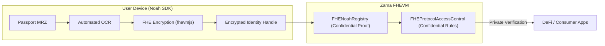

# NOAH: Privacy-Preserving KYC for Zama

**NOAH** (Network for On-chain Authenticated Handshakes) is a state-of-the-art, zero-knowledge proof-based identity protocol for the Zama ecosystem. It enables applications (Gaming, DeFi, and Consumer Apps) to verify user compliance (age, jurisdiction, sanctions) without ever touching or storing personal data.

## 🚀 The Noah Vision: "Verify Once, Use Everywhere"

Noah eliminates the redundancy of KYC on-chain. By using Zero-Knowledge Proofs (ZKP), users bind their identity to their wallet address once. This verification is then instantly reusable across every integrated app on Zama—from DeFi protocols to Web3 games—while maintaining 100% user privacy.

---

## 🌟 Use Cases

Here is what you can build with Noah:

### 1. Gaming & Web3 E-Sports
Keep your leaderboards fair. Verify that each player is a unique human behind the keyboard, putting an end to multi-accounting and bots.

### 2. Consumer Applications
Age-gate your content or services effortlessly. Prove your user is over 18 without asking them to upload a photo of their ID card to your servers.

### 3. DeFi & RWA Platforms
Onboard users securely. Meet strict KYC requirements while preserving your users' on-chain privacy.

---

## 🎨 Interactive Experience

Noah isn't just a protocol; it's a complete platform with professional presentation tools:

- **Professional Pitch Deck**: An interactive, slide-based presentation built directly into the UI to communicate Noah's value proposition to stakeholders.
- **Visual Data Flow**: A high-fidelity animated diagram that visualizes the technical process of transforming sensitive MRZ data into private ZK-Proofs.

---

## 🏗️ Architecture: Backend-less & Decentralized

Unlike legacy systems, Noah operates without a central backend for proof generation. All cryptographic heavy lifting occurs on the user's device.

### High-Level Flow



---

## 🛠️ Key Components

### 1. Noah SDK (Client-Side)
The heart of the protocol. It handles:
- **Automated OCR**: Extracts MRZ data from passport images locally.
- **FHE Engine**: Uses `fhevmjs` and `@zama-fhe/relayer-sdk` to encrypt identity attributes (like age) client-side.
- **Identity Binding**: Authorizes the registry/issuer to process the encrypted handle securely on-chain.

### 2. FHENoahRegistry.sol
The on-chain source of truth for identity status:
- **Confidential State**: Stores identity data as encrypted FHE types (`euint8`, etc.).
- **Access Control**: Manages trusted issuers who can register identities on behalf of users.
- **Privacy**: No one, including the node operators, can see the decrypted identity values.

### 3. FHEProtocolAccessControl.sol
The gateway for private applications:
- **Confidential Computation**: Runs on-chain logic (e.g., `age > 18`) directly on encrypted data.
- **Zero Exposure**: Protocols receive a boolean verification result without ever seeing the raw encrypted data or the decrypted value.

---

## 🛡️ Security & Privacy

### Fully Homomorphic Encryption
Noah uses **FHE**—the protocol performs computations on *encrypted data*. Instead of revealing data, the contract computes the result (e.g., "Is User > 18?") while the data remains encrypted.

### Zero-Data Architecture
- **No Backend**: No central server ever sees or processes the user's passport data.
- **Client-Side Encryption**: Encryption happens in a secure environment on the user's device.
- **Nullifier Protection**: Uses salted hashes to prevent identity tracking across different protocols.

---

## 💻 Getting Started

### Installation
```bash
npm install noah-protocol
```

### Quick Usage (SDK)
```typescript
import { NoahSDK } from 'noah-protocol';

const sdk = new NoahSDK({ provider: window.ethereum });

// 1. Scan Passport
const mrzData = await sdk.extractPassportData(image);

// 2. Encrypt Identity (Age)
const { handle } = await sdk.user.encryptIdentity({ age: 18 });

// 3. Register & Verify on Zama
await sdk.contracts.registerIdentity(userAddress, handle);
```

---

## 🛠️ Development

### Prerequisites
- **Foundry**: For smart contract development and testing.
- **Go**: For ZK circuit implementation (Gnark).
- **Node.js**: For the SDK and Frontend.

### Commands
```bash
# Test Contracts
forge test

# Generate Circuits (Go)
go build ./circuit/...

# Build Frontend
cd frontend && npm run build
```

---

## 📜 License & Project
**Repository**: [Samuel1-ona/Noah-](https://github.com/Samuel1-ona/Noah-)  
**Status**: Live on Zama Sepolia Testnet  
**Powered by**: Solidity, and Zama.
